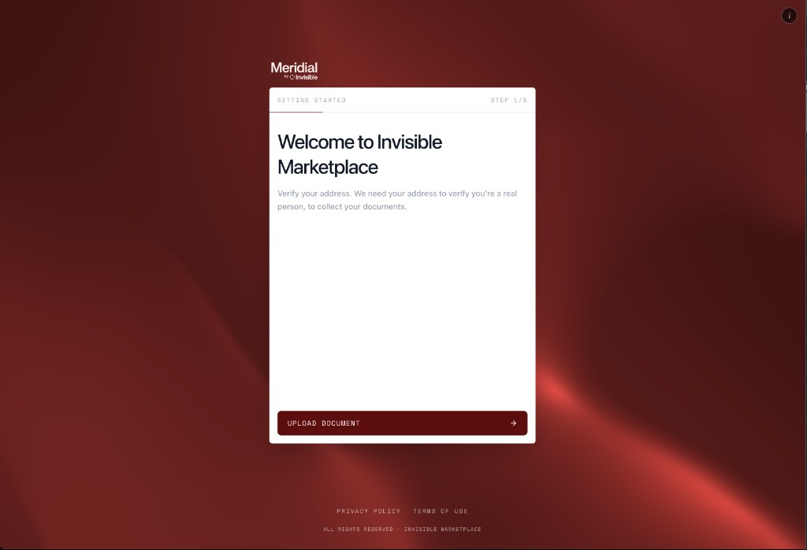

# Meridial — Address Verification Flow



A 5-step document verification wizard that extracts address data from uploaded documents using LLM-powered OCR.

## Flow

1. **Welcome** — Landing screen with consent banner
2. **Upload** — Click or drag-and-drop a PDF/image (JPEG, PNG, WebP)
3. **Analyzing** — Document is sent to `/api/meridial/extract`, status messages cycle while waiting
4. **Verification** — Extracted address fields are shown for user review/correction
5. **Complete** — Confirmation screen

## Structure

```
meridial/
├── page.tsx              # Main page, orchestrates steps and API call
├── layout.tsx            # Metadata
├── constants.ts          # Fonts, step labels, status messages
├── types.ts              # AddressData, Step, Zod schema
├── components/
│   ├── fluid-background  # WebGL shader (animated silk texture, mouse-reactive lighting)
│   ├── shader-controls   # Dev-only panel to tweak shader params (persisted to localStorage)
│   ├── step-card         # Animated card wrapper with progress bar
│   ├── welcome-step      # Step 1
│   ├── upload-step       # Step 2 (file input + drag-and-drop)
│   ├── analyzing-step    # Step 3 (spinner + cycling status)
│   ├── verification-step # Step 4 (address form)
│   ├── complete-step     # Step 5
│   ├── cookie-banner     # GDPR consent overlay
│   ├── primary-button    # Shared CTA button
│   ├── back-button       # Shared back arrow
│   ├── step-heading      # Shared heading typography
│   ├── step-description  # Shared body text
│   ├── checkbox-option   # Toggle option (used in complete step)
│   └── logo              # SVG logo
├── privacy/page.tsx      # Privacy policy page
└── terms/page.tsx        # Terms of use page
```

## API

`POST /api/meridial/extract` — accepts a `file` via `FormData`, returns:

```json
{
  "fullName": "...",
  "streetAddress": "...",
  "city": "...",
  "state": "...",
  "zipCode": "...",
  "country": "..."
}
```

Supports PDF, JPEG, PNG, and WebP. PDFs are processed page-by-page; images are resized before sending to the LLM.

## E2E Tests

Tests live in `e2e/meridial.spec.ts` (Playwright). The API is mocked so tests don't require LLM credentials.

```bash
npm run test:e2e
```
